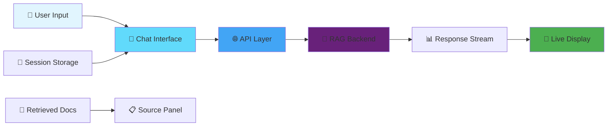

# 🌟 RAG News Frontend

<div align="center">


**💬 Beautiful Chat Interface for Intelligent News Discovery**

*Real-time streaming conversations powered by RAG architecture*

[🚀 Quick Start](#-quickstart) • [💬 Features](#-features) • [🎨 Screenshots](#-screenshots) • [🚀 Deploy](#-deployment)

</div>

---

## ✨ Features

🎯 **Intelligent Chat Interface** - Clean, modern conversation UI  
⚡ **Real-time Streaming** - Live token-by-token response display  
📱 **Responsive Design** - Perfect on desktop, tablet, and mobile  
🗂️ **Session Management** - Persistent conversation history  
📄 **Source Citations** - View retrieved documents and sources  
🌙 **Modern UX** - Smooth animations and intuitive interactions  
🔄 **Auto-reconnect** - Robust connection handling for streaming  

## 🏗️ System Integration



## 🛠️ Tech Stack

| Component | Technology | Purpose |
|-----------|------------|---------|
| **⚛️ Framework** | `React 18` | Modern UI library with hooks |
| **⚡ Build Tool** | `Vite` | Lightning-fast development & builds |
| **🎨 Styling** | `SCSS/CSS Modules` | Modular, maintainable styles |
| **📡 API Client** | `Fetch API + SSE` | REST calls & real-time streaming |
| **📱 Responsive** | `CSS Grid + Flexbox` | Mobile-first responsive design |
| **🚀 Deployment** | `Vercel` | Edge-optimized static hosting |

## 🚀 Quickstart

### 📋 Prerequisites

- Node.js 18+ 
- Your RAG News Backend running (locally or deployed)

### ⚡ Installation

```bash
# Clone the repository
git clone <your-frontend-repo-url>
cd rag-news-frontend

# Install dependencies
npm install
```

### 🔧 Environment Configuration

Create a `.env.local` file in the root directory:

```env
# 🌐 Backend API Configuration
VITE_API_URL=http://localhost:4000/api

# For production deployment:
# VITE_API_URL=https://your-backend.onrender.com/api
```

### 🏃‍♂️ Development Server

```bash
# Start development server with hot reload
npm run dev

# Open http://localhost:5173 in your browser
```

### 🏗️ Build & Preview

```bash
# Build for production
npm run build

# Preview production build locally
npm run preview
```

## 💬 Chat Interface Features

### 🎯 Core Functionality

- **💭 Natural Conversations** - Type questions in natural language
- **⚡ Streaming Responses** - Watch answers appear in real-time
- **📄 Source Display** - See retrieved articles and relevance scores
- **🔄 Session Continuity** - Conversations persist across page reloads

### 🎨 User Experience

- **🌊 Smooth Animations** - Typing indicators and message transitions
- **📱 Mobile Optimized** - Touch-friendly interface for all devices
- **♿ Accessibility** - ARIA labels and keyboard navigation
- **🎭 Loading States** - Clear feedback during processing

## 📋 API Integration

### 🔗 Backend Communication

The frontend communicates with the RAG News Backend through:

```javascript
// Chat with streaming response
POST /api/chat/stream
{
  "message": "What's happening in tech?",
  "sessionId": "optional-session-id"
}

// Save conversation and get sources
POST /api/chat
{
  "message": "User message",
  "sessionId": "session-123"
}

// Retrieve conversation history
GET /api/session/{sessionId}/history

// Clear conversation
POST /api/session/{sessionId}/clear
```

### 📊 Response Handling

```javascript
// Streaming response format (SSE)
data: {"token": "The", "done": false}
data: {"token": " latest", "done": false}
data: {"sessionId": "123", "done": true}

// Regular response format
{
  "sessionId": "unique-session-id",
  "reply": "Complete response text",
  "retrieved": [
    {
      "title": "Article Title",
      "content": "Relevant excerpt...",
      "score": 0.87
    }
  ]
}
```

## 🎨 Component Architecture

```
.
├── node_modules/
├── public/
├── src/
│   ├── api/
│   │   └── api.js
│   ├── assets/
│   ├── components/
│   │   ├── ChatWindow.jsx
│   │   ├── HealthBadge.jsx
│   │   ├── Message.jsx
│   │   └── Sidebar.jsx
│   ├── styles/
│   │   └── main.scss
│   ├── App.css
│   ├── App.jsx
│   ├── index.css
│   └── main.jsx
├── .gitignore
├── Dockerfile
├── eslint.config.js
├── index.html
├── package-lock.json
├── package.json
├── README.md
└── vite.config.js

```

## 🚀 Deployment

### 🌐 Vercel Deployment (Recommended)

1. **🔗 Connect Repository**
   ```bash
   # Push your code to GitHub
   git add .
   git commit -m "feat: add RAG news frontend"
   git push origin main
   ```

2. **⚙️ Vercel Setup**
   - Connect your GitHub repo to Vercel
   - Framework preset: **Vite**
   - Build command: `npm run build`
   - Output directory: `dist`

3. **🔧 Environment Variables**
   In Vercel dashboard → Settings → Environment Variables:
   ```
   VITE_API_URL = https://your-backend.onrender.com/api
   ```

4. **🚀 Deploy**
   - Vercel will auto-deploy on every push to main
   - Your app will be available at `https://your-app.vercel.app`

### 🐳 Docker Deployment

```dockerfile
FROM node:18-alpine as builder
WORKDIR /app
COPY package*.json ./
RUN npm ci
COPY . .
RUN npm run build

FROM nginx:alpine
COPY --from=builder /app/dist /usr/share/nginx/html
COPY nginx.conf /etc/nginx/nginx.conf
EXPOSE 80
CMD ["nginx", "-g", "daemon off;"]
```

### 📦 Static Hosting Options

- **▲ Vercel** - Recommended for React apps
- **🌐 Netlify** - Great for static sites with forms
- **☁️ AWS S3 + CloudFront** - Enterprise-grade hosting
- **🔥 Firebase Hosting** - Google's hosting solution

## 🔧 Troubleshooting

### 🚨 Common Issues

#### ❌ "Failed to fetch" Errors
```bash
# Check your backend URL in .env.local
VITE_API_URL=https://your-backend.onrender.com/api  # ✅ Correct
VITE_API_URL=https://your-backend.onrender.com      # ❌ Missing /api
```

#### 🔄 Streaming Not Working
- Verify your backend supports Server-Sent Events
- Check browser network tab for connection errors
- Ensure CORS is configured on your backend

#### 📱 Mobile Display Issues
- Test responsive breakpoints in browser dev tools
- Verify touch events work on mobile devices
- Check viewport meta tag in index.html

#### 🌐 Deployment Issues
- Confirm `VITE_API_URL` points to your deployed backend
- Verify backend CORS allows your frontend domain
- Check browser console for specific error messages

### 🐛 Debug Mode

Enable detailed logging by adding to your `.env.local`:
```env
VITE_DEBUG=true
VITE_LOG_LEVEL=debug
```

### 📊 Performance Optimization

```javascript
// Lazy load components for better performance
const SourcePanel = lazy(() => import('./components/SourcePanel/SourcePanel'));

// Implement proper error boundaries
<ErrorBoundary fallback={<ErrorMessage />}>
  <ChatInterface />
</ErrorBoundary>

// Optimize bundle size
npm run build -- --analyze
```

## 🧪 Development

### 🔍 Code Quality

```bash
# Run linting
npm run lint

# Fix linting issues
npm run lint:fix

# Format code
npm run format

# Type checking (if using TypeScript)
npm run type-check
```

### 🧪 Testing

```bash
# Run unit tests
npm run test

# Run tests with coverage
npm run test:coverage

# E2E testing with Playwright
npm run test:e2e
```

### 📈 Bundle Analysis

```bash
# Analyze bundle size
npm run build
npm run analyze

# Check for unused dependencies
npx depcheck
```

## 🎯 Feature Roadmap

- 🔍 **Advanced Search** - Filter by date, source, topic
- 🌙 **Dark Mode Toggle** - Theme switching capability
- 📊 **Analytics Dashboard** - Usage metrics and insights
- 🔖 **Bookmarking** - Save favorite conversations
- 📤 **Export Options** - Download conversations as PDF/markdown
- 🌍 **Internationalization** - Multi-language support

## 🤝 Contributing

1. Fork the repository
2. Create a feature branch: `git checkout -b feature/amazing-feature`
3. Follow the coding standards and add tests
4. Commit changes: `git commit -m 'Add amazing feature'`
5. Push to branch: `git push origin feature/amazing-feature`
6. Open a Pull Request


---

<div align="center">

**🌟 Part of the RAG News System**

[Backend Repository](https://github.com/your-username/rag-news-backend) • [Live Demo](https://rag-powered-chatbot-frontend-lovat.vercel.app/) • [API Documentation](https://your-backend.onrender.com/docs)

**💡 Built with modern React for intelligent news discovery**

</div>
